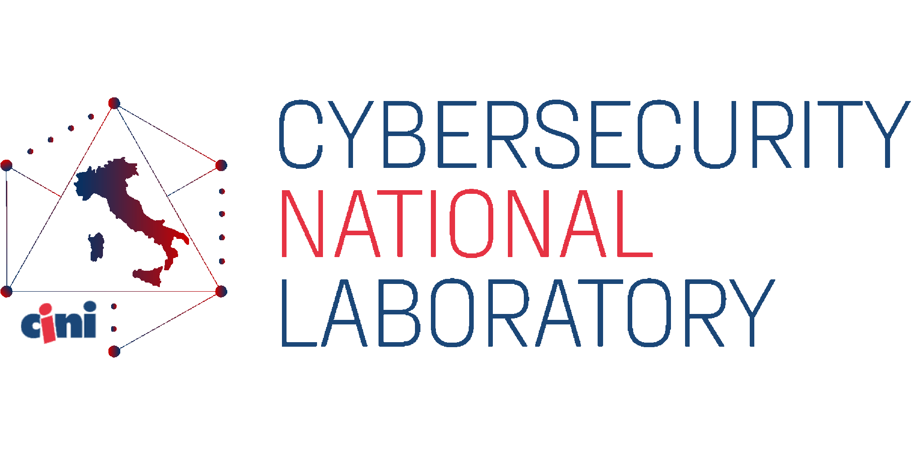

# Srdnlen CTF 2025

Srdnlen CTF 2025 is the third edition of the online Jeopardy-style Capture-The-Flag competition hosted by the members of [Srdnlen](https://srdnlen.it/), an italian team based in Sardinia, supported by the italian [Cybersecurity National Laboratory](https://cybersecnatlab.it/).

   

The competition marks the first round of the third edition of [CyberCup](https://cybercup.it), an Italian CTF tournament.

## Challenges

| Category | Title                                                       | Author                                                                     | Dynamic            | Type  | Url                            | Port  |
| :------- | :---------------------------------------------------------- | :------------------------------------------------------------------------- | :----------------: | ----: | -----------------------------: | :---: |
| crypto   | [Based sbox](crypto_Based-sbox)                             | Lornezo Siriu <@lrnzsir>                                                   | :heavy_check_mark: | tcp   | basedsbox.challs.srdnlen.it    | 46173 |
| crypto   | [Chess](crypto_Chess)                                       | Niccolò Viale <@fiara>                                                      | :heavy_check_mark: | tcp   | chess.challs.srdnlen.it        | 4012  |
| crypto   | [Confusion](crypto_Confusion)                               | Giovanni Manca <@Zaua>                                                       | :heavy_check_mark: | tcp   | confusion.challs.srdnlen.it    | 1338  |
| crypto   | [zk-Openings](crypto_zk-openings)                           | Lorenzo Siriu <@lrnzsir>                                                   | :x:                |       |                                |       |
| dfir     | [DFIR 1 - Malvent](dfir_1_Malvent)                          | Silvia Sanna <@slsanna>                                                    | :heavy_check_mark: | tcp   | dfir1.challs.srdnlen.it        | 1984  |
| dfir     | [DFIR 2 - Malvent](dfir_2_Malnet)                           | Silvia Sanna <@slsanna>                                                    | :heavy_check_mark: | tcp   | dfir2.challs.srdnlen.it        | 1985  |
| dfir     | [DFIR 3 - Malvent](dfir_3_RAMsomwhere)                      | Silvia Sanna <@slsanna>                                                    | :heavy_check_mark: | tcp   | dfir3.challs.srdnlen.it        | 1986  |
| dfir     | [DFIR 4 - Malvent](dfir_4_MalThrInt)                        | Silvia Sanna <@slsanna>                                                    | :heavy_check_mark: | tcp   | dfir4.challs.srdnlen.it        | 1987  |
| foren    | [Cheese with Friends](foren_Cheese_with_Friends)            | Matteo Chiesa <@church>                                                    | :x:                |       |                                |       |
| foren    | [Disk Operating System](foren_DiskOperatingSystem)          | Davide Maiorca <@Davezero>, Daniele Orrù <@Den1211>, Simone Sulis <@salsa> | :x:                |       |                                |       |
| gamepwn  | [UnityOs](gamePwn_UnityOs)                                  | Massimo Sanna <@SannaZ>                                                    | :x:                |       |                                |       |
| misc     | [Another Impossible Escape](misc_Another_Impossible_Escape) | Nicholas Meli <@uNickz>                                                    | :heavy_check_mark: | tcp   | aie.challs.srdnlen.it          | 3434  |
| misc     | [SSPJ](misc_SSPJ)                                           | Nicholas Meli <@uNickz>                                                    | :heavy_check_mark: | tcp   | sspj.challs.srdnlen.it         | 1717  |
| pwn      | [Future Desk Market](cryptopwn_FDM)                         | Diego Oliva <@doliv>, Davide Sechi <@guaddu>                               | :heavy_check_mark: | tcp   | fdm.challs.srdnlen.it          | 2025  |
| pwn      | [A child's dream](pwn_A_childs_dream)                       | Davide Maiorca <@davezero>, Matteo Chiesa <@church>                        | :x:                |       |                                |       |
| pwn      | [Snowstorm](pwn_Snowstorm)                                  | Matteo Chiesa <@church>                                                    | :heavy_check_mark: | tcp   | snowstorm.challs.srdnlen.it    | 1089  |
| pwn      | [Kinderheim 511](pwn_kinderheim_511)                        | Matteo Cornacchia <@zoop>                                                       | :heavy_check_mark: | tcp   | k511.challs.srdnlen.it         | 1660  |
| rev      | [Anodic Music](rev_anodic_music)                            | Matteo Cornacchia <@zoop>                                                       | :x:                |       |                                |       |
| rev      | [It's not what it seems](rev_itsnotwhatitseems)             | Simone Sulis <@salsa>                                                      | :x:                |       |                                |       |
| web      | [Ben 10](web_Ben10)                                         | Bruno Pala <@gheddus>                                                    | :heavy_check_mark: | tcp   | ben10.challs.srdnlen.it        | 80    |
| web      | [Average HTTP/3 Enjoyer](web_averageHTTP3enjoyer)           | Lorenzo Pisu <@pysu>                                                       | :heavy_check_mark: | http  | enjoyer.challs.ctf.srdnlen.it  | 80    |
| web      | [Sparkling Sky](web_sparklingsky)                           | Matteo Sanna <@sanmatte>                                                   | :heavy_check_mark: | http  | sparklingsky.challs.srdnlen.it | 80    |
| web      | [Focus. Speed. I am speed.](web_speed)                      | Federico Loi <@Octaviusss>                                                 | :heavy_check_mark: | tcp   | speed.challs.srdnlen.it        | 80    |

