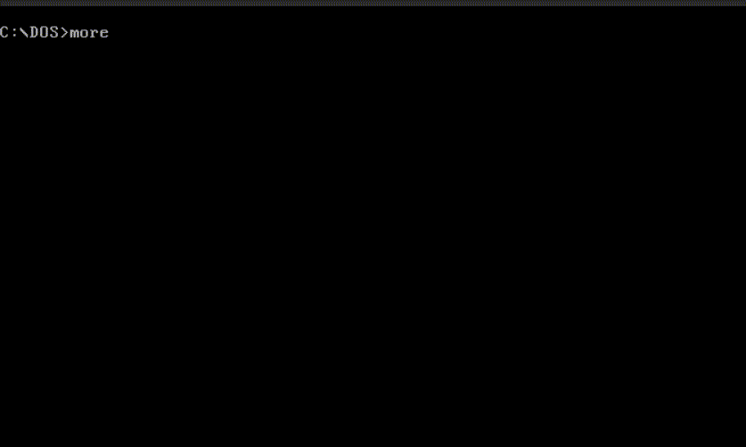

# DiskOperatingSystem

CTF: Srdnlen CTF 2025\
Category: foren\
Difficulty: ?\
Author: Davide Maiorca <@Davezero>, Daniele Orrù <@Den1211>, Simone Sulis <@salsa>

# Description
The challenge entails finding a password lost inside a MS-DOS image, that has been slightly modified.  

# Solution
The only file provided by the challenge is a Qemu Copy On Write Disk Image, that once started boots up a version of MS-DOS, precisely the 4.00:

The main idea is to check what differences there are between this disk image of MS-DOS and the one recently released (9 months ago) by Microsoft: [https://github.com/microsoft/MS-DOS](https://github.com/microsoft/MS-DOS).

The only different file is MORE.com, but that’s not immediately evident, because its file size has been brought to the same of the original file along with the original date:

To find this you need to check either by comparing different commands (preferably with a batch script) or by checking with diff between the internals of the original image and the one provided by the challenge.

Once you notice something’s wrong with MORE, the solve from there is actually pretty simple, you only need to execute the command by tiping “MORE”, and keep an eye open for out of place letters:

And so the flag is: srdnlen{d1d_y0u_kn0w_th4t_th3_D0S_s0urc3_w4s_r3l34s3d?}
